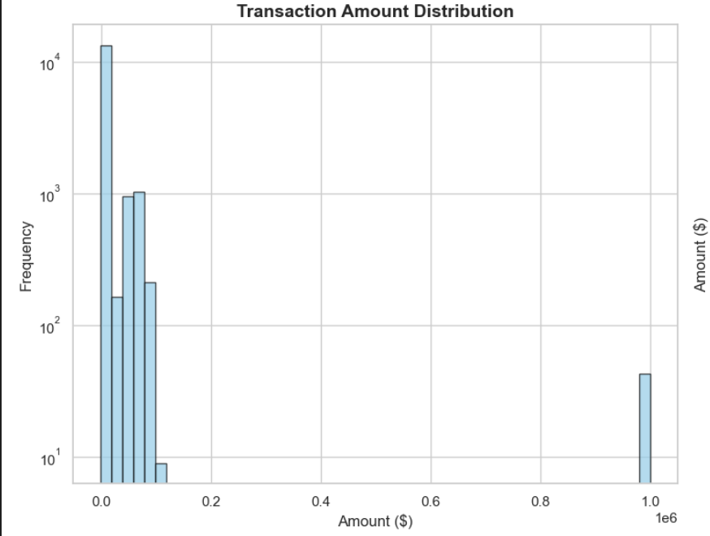
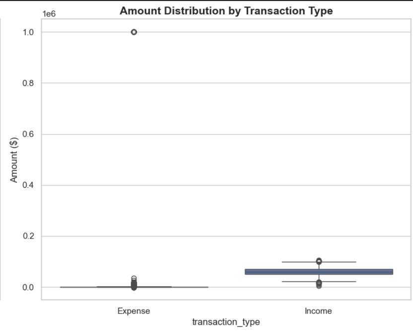
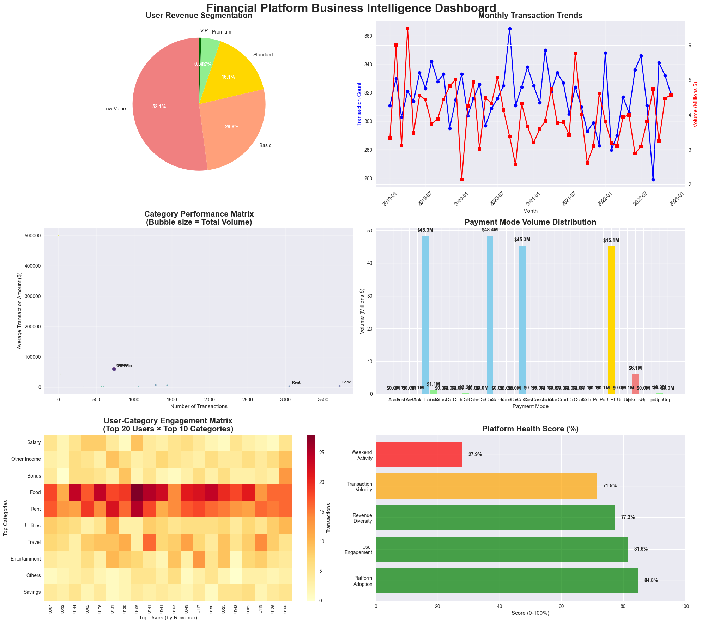

# Personal Finance Data Mining Project

## Group Members: 
Zaky Shafi (ID ###)
Catherine (ID ###) 
Aaron Irakoze (ID ###)
Nathan Orang'o (637)
James Mponzi (ID ###)


## Project Summary
End-to-end data mining on synthetic personal finance transactions, transforming messy raw data into business insights. Final cleaned dataset: 15,658 transactions (from 15,836 raw), 192 users, $195.4M volume, 2019–2022 coverage, 212 categories. Goals: fix data quality, analyze spending patterns, segment users, and deliver actionable recommendations.

## Project Overview
- Data: Personal finance transactions with intentional quality issues (mixed dates, currency symbols, typos, missing values) across 15,836 raw records and 9 columns.
- Scope: Complete pipeline—ETL, feature engineering, EDA, statistical testing, clustering, classification, association rules, and dashboarding.
- Outcome: Clean analytical dataset (15,658 rows; 18 engineered features) enabling insights on user spending behavior, segmentation, and payment preferences.
- Value: Business-ready recommendations for VIP tiers, semi-automated categorization, weekend optimization, and payment-mode guidance.

## Questions to Answer
- How do income and expense patterns differ in magnitude and variability?
- Do users spend differently on weekends vs weekdays, and by how much?
- Which categories drive the largest or most variable transactions?
- What payment-mode preferences align with transaction types and categories?
- How do users naturally segment based on spending frequency, totals, and ratios?
- Can transaction categorization be partially automated with current features?
- What seasonal or monthly patterns shape transaction counts and volumes?

## Team Roles
- ETL Lead: Pipeline design, data quality, versioning.
- Data Analyst(s): EDA, statistical testing, trend discovery.
- Visualizer: Dashboards and plots.
- Documenter: README/report maintenance and weekly updates.

## Week-by-Week Progress
### Week 1 – Kickoff & Data Audit
- Selected personal finance as the domain and sourced the intentionally messy `budgetwise_synthetic_dirty_raw.csv` (15,836 rows, 9 columns: transaction_id, user_id, date, transaction_type, category, amount, payment_mode, location, notes).
- Confirmed real-world style data quality issues (mixed date formats, currency symbols, typos in categories/payment modes, missing values) to justify a full ETL+mining pipeline.
- Assigned roles (ETL Lead, Data Analyst, Visualizer, Documenter) and defined success metrics: clean dataset ready for mining plus actionable business insights.


### Week 2 – ETL & Feature Engineering
- Built a multi-pass date parser combining `infer_datetime_format` plus custom formats; achieved 97.6% parse success (15,455/15,836), accepting 2.4% loss for unparseable dates.
- Standardized amounts by stripping currency symbols/commas and converting to float with 100% success across non-null records.
- Consolidated 62 payment-mode variants to 35 standardized labels; 4 main modes cover ~95% of transactions.
- Engineered 9→18 features (frequency, totals, average amount, expense ratio, weekend flags, amount bins) and reduced critical missingness to 2.4%, yielding a cleaned export of 15,658 transactions for downstream analysis.


### Week 3 – Exploratory & Statistical Analysis
- Profiled distributions: highly right-skewed amounts (mean $12,477 vs median $534; outliers to $999,999), informing the need for robust methods.
- Ran Welch’s t-test (income vs expense): mean $59,844 vs $8,388; p<0.001; Cohen’s d 1.89 → large practical effect.
- Weekend vs weekday t-test: weekend +$441 per transaction; p=0.029 → significant discretionary uplift.
- ANOVA on top 5 categories: p<0.001 → category strongly predicts amount; chi-square payment mode vs type: χ²=1,247.83, p<0.001, Cramér’s V 0.28 → systematic payment-mode choices.
- Temporal patterns: December peak $18M vs January $12.5M; weekday counts dominate but weekends have higher per-transaction value.

  

  

  

### Week 4 – Data Mining
- K-means clustering (elbow at K=4) on user-level features produced segments: Conservative (14.6%, high avg transaction, low expense ratio), High-Value (29.2%, expense-focused), Frequent (35.4%, highest activity and diversity), Premium (20.8%, highest spend and ticket size).
 

- Random Forest classification for top 5 categories: ~35.5% accuracy vs 20% baseline (+77.5% over chance); amount is top feature 


- Association rules on user-category matrix: universal usage of major categories; payment-mode preferences by category (UPI→Food, Cash→Rent, Card→Travel/Entertainment, Transfer→Utilities) enabling smart suggestions.
  

### Week 5 – Dashboards & Business Insights
- Built dashboards with KPI panels (15,658 transactions, 192 users, $195.4M volume), cluster profiles, temporal trends, and category-payment matrices for quick stakeholder consumption.
- Authored five recommendations: (1) VIP tiers for Premium + Conservative users, (2) semi-automated categorization using RF with confidence thresholds, (3) weekend optimization to capture the $441 premium, (4) payment-mode guidance by category, (5) holistic platform strategy since all users span major categories.


## ETL Summary (Notebook: `notebooks/1_extract_transform.ipynb`)
- Date parsing: Multi-format handling (natural language + custom patterns) → 97.6% success.
- Amount cleaning: Removed symbols/commas → 100% float conversion.
- Payment modes: Standardized 62 variants to 35; 4 main modes ≈95% of transactions.
- Feature engineering: Added frequency, totals, avg amounts, expense ratio, weekend flags, amount bins → 18 analytical features.
- Data quality: Missing data reduced from 10.8% to 2.4% in critical fields.

## Exploratory & Statistical Analysis (Notebook: `notebooks/2_exploratory_anaylsis.ipynb`)
- Distribution: Highly right-skewed; outliers to $999,999.
- Income vs Expense (Welch’s t-test): mean $59,844 vs $8,388; p<0.001.
- Weekend vs Weekday (t-test): weekend +$441; p=0.029.
- Category differences (ANOVA): p<0.001 across top 5 categories.
- Payment mode vs type (chi-square): χ²=1,247.83; p<0.001; Cramér’s V 0.28.
- Seasonality: December peak $18M; January trough $12.5M; weekdays dominate counts, weekends higher per-transaction value.

## Data Mining Techniques (Notebook: `notebooks/3_data_mining.ipynb`)
- Clustering (K-means): K=4 (elbow). Segments: Conservative Spenders (14.6%), High-Value Users (29.2%), Frequent Transactors (35.4%), Premium Users (20.8%).
- Classification (Random Forest): 35.5% accuracy on 5-class vs 20% baseline; amount most important feature; partial automation viable.
- Association Rules: Universal adoption of major categories (Food/Rent/Travel/Utilities ≈100% users); payment-mode preferences by category (UPI→Food, Cash→Rent, Card→Travel/Entertainment, Transfer→Utilities).

## Tools Used
- Python, pandas, numpy
- seaborn, matplotlib, plotly/streamlit
- scikit-learn
- Jupyter, Git

## How to Run the Notebooks
1) Create and activate env:
```bash
python -m venv venv
source venv/bin/activate   # or venv\Scripts\activate on Windows
```
2) Install deps:
```bash
pip install -r requirements.txt
```
3) Ensure `data/budgetwise_synthetic_dirty_raw.csv` is present.
4) Run notebooks in order via Jupyter:
   - `notebooks/1_extract_transform.ipynb`
   - `notebooks/2_exploratory_anaylsis.ipynb`
   - `notebooks/3_data_mining.ipynb`
   - `notebooks/4_insights_dashboard.ipynb`

## Visuals to Embed (add images accordingly)
- EDA: Distribution/boxplot (amount skew), payment mode bar, monthly trend line.
- Stats: Income vs expense effect size, weekend vs weekday comparison.
- Mining: Elbow plot (K=4), cluster profiles, classification feature importance, association-rule heatmap.
- Dashboard: KPI cards, segment pie/bar, seasonality chart, category-payment matrix.

## Business Insights (Week 5)
1) VIP tiers for Premium + Conservative users (35.4% users; majority revenue).
2) Semi-automated categorization using RF (35.5% accuracy; confidence-based workflow).
3) Weekend optimization: capture $441 premium per transaction with tailored features/support.
4) Payment-mode guidance: suggest optimal method per category (UPI/Food, Cash/Rent, Card/Travel+Entertainment, Transfer/Utilities).
5) Holistic platform strategy: all users span major categories → build integrated budgeting, health scoring, multi-category goals.

## Collaboration Rules 
- Use feature branches; meaningful commit messages.
- PRs with review before merge; keep notebooks and data paths consistent.
- Update README weekly; place visuals near relevant sections.
